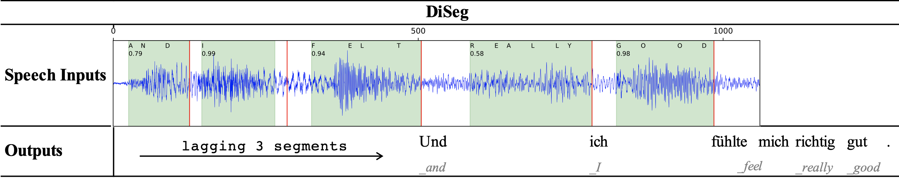

# End-to-End Simultaneous Speech Translation with Differentiable Segmentation

Source code for our ACL 2023 paper "[End-to-End Simultaneous Speech Translation with Differentiable Segmentation](https://aclanthology.org/2023.findings-acl.485.pdf)"



## Overview
- [Installation](#installation)
- [Quick Start](#quick-start)
  - [Data Pre-processing](#data-pre-processing)
  - [Training](#Training)
    - [0. (optional) Pre-training on MT Data](#0-optional-pre-training-on-mt-data)
    - [1. Training DiSeg](#1-training-diseg)
  - [Inference](#inference)
    - [1. Offline Speech Translation with DiSeg](#1-offline-speech-translation-with-diseg)
    - [2. Simultaneous Speech Translation with DiSeg](2-simultaneous-speech-translation-with-diseg)
    - [3. Segment Speech with DiSeg](3-segment-speech-with-diseg)
- [Results](#results)
- [Citation](#citation)

## Installation

- DiSeg is implemented based on the open-source toolkit [Fairseq](https://github.com/pytorch/fairseq), install DiSeg:

  ```bash
  git clone https://github.com/ictnlp/DiSeg.git
  cd DiSeg
  pip install --editable ./
  ```

## Quick Start

### Data Pre-processing

We use [MuST-C data](https://nlp.stanford.edu/projects/nmt/) from English TED talks. Download `MUSTC_v1.0_en-${LANG}.tar.gz` to the path `${MUSTC_ROOT}`, and then preprocess it with:

```bash
MUSTC_ROOT=path_to_mustc_data
LANG=de
tar -xzvf ${MUSTC_ROOT}/MUSTC_v1.0_en-${LANG}.tar.gz

# 1. prepare raw mustc data
python3 examples/speech_to_text/prep_mustc_data_raw.py \
    --data-root ${MUSTC_ROOT} --tgt-LANG ${LANG}

# 2. prepare vocabulary
python3 examples/speech_to_text/prep_vocab.py \
    --data-root ${MUSTC_ROOT} \
    --vocab-type unigram --vocab-size 10000 --joint \
    --tgt-LANG ${LANG}

# 3. prepare mustc mt data
MUSTC_TEXT_ROOT=${MUSTC_ROOT}/en-${LANG}-text
SPM_MODEL==${MUSTC_ROOT}/en-${LANG}/spm_unigram10000_raw.model
mkdir ${MUSTC_TEXT_ROOT}

for SPLIT in train dev tst-COMMON
do
    for L in en ${LANG}
    do
        python3 examples/speech_to_text/apply_spm.py \
            --input-file ${MUSTC_ROOT}/en-${LANG}/data/${SPLIT}/txt/${SPLIT}.${L} \
            --output-file ${MUSTC_TEXT_ROOT}/${SPLIT}.spm.${L}  \
            --model ${SPM_MODEL}
    done
done

fairseq-preprocess --source-lang en --target-lang ${LANG} \
    --trainpref ${MUSTC_TEXT_ROOT}/train.spm --validpref ${MUSTC_TEXT_ROOT}/dev.spm \
    --testpref ${MUSTC_TEXT_ROOT}/tst-COMMON.spm \
    --destdir data-bin/mustc_en_${LANG}_text \
    --tgtdict ${MUSTC_ROOT}/en-${LANG}/spm_unigram10000_raw.txt \
    --srcdict ${MUSTC_ROOT}/en-${LANG}/spm_unigram10000_raw.txt \
    --nwordssrc 10000 --nwordstgt 10000 \
    --workers 60

# 4. generate the wav list and reference file for SimulEval
EVAL_ROOT=path_to_save_simuleval_data # such as ${MUSTC_ROOT}/en-de-simuleval
for SPLIT in dev tst-COMMON
do
    python examples/speech_to_text/seg_mustc_data.py \
    --data-root ${MUSTC_ROOT} --LANG ${LANG} \
    --split ${SPLIT} --task st \
    --output ${EVAL_ROOT}/${SPLIT}
done

```

Finally, the directory `${MUSTC_ROOT}` should look like:

```
.
├── en-de/
│   ├── config_raw.yaml
│   ├── spm_unigram10000_raw.model
│   ├── spm_unigram10000_raw.txt
│   ├── spm_unigram10000_raw.vocab
│   ├── dev_raw_st.tsv
│   ├── tst-COMMON_raw_st.tsv
│   ├── train_raw.tsv
│   ├── tst-COMMON_raw.tsv
│   ├── tst-HE_raw.tsv
│   ├── docs/
│   ├── data/
├── en-de-text/
│   ├── train.spm.en
│   ├── train.spm.de
│   ├── dev.spm.en
│   ├── dev.spm.de
│   ├── tst-COMMON.spm.en
│   ├── tst-COMMON.spm.de
├── data-bin/
│   ├── mustc_en_de_text/
│   │   ├── dict.en.txt
│   │   ├── dict.de.txt
│   │   ├── preprocess.log
│   │   ├── ***.bin
│   │   ├── ***.idx
├── en-de-simuleval/
│   ├── tst-COMMON/
│   │   ├── tst-COMMON.de
│   │   ├── tst-COMMON.wav_list
│   │   ├── ted_****_**.wav
│   │   ├── ...
│   ├── dev/
│   │   ├── dev.de
│   │   ├── dev.wav_list
│   │   ├── ted_****_**.wav
│   │   ├── ...
└── MUSTC_v1.0_en-de.tar.gz
```

- Config file `config_raw.yaml` should be like this.

```yaml
bpe_tokenizer:
  bpe: sentencepiece
  sentencepiece_model: ABS_PATH_TO_SENTENCEPIECE_MODEL
input_channels: 1
prepend_tgt_lang_tag: true
use_audio_input: true
vocab_filename: spm_unigram10000_raw.txt
```

- Training data `train_raw.tsv` should be like:

```
id      audio   n_frames        src_text        tgt_text        speaker src_lang        tgt_lang
ted_1_0 /data/zhangshaolei/datasets/MuSTC_new/en-de/data/train/wav/ted_1.wav:98720:460800       460800  And it's truly a great honor to have the opportunity to come to this stage twice; I'm extremely grateful. I have been blown away by this conference, and I want to thank all of you for the many nice comments about what I had to say the other night.   Vielen Dank, Chris. Es ist mir wirklich eine Ehre, zweimal auf dieser Bühne stehen zu dürfen. Tausend Dank dafür. Ich bin wirklich begeistert von dieser Konferenz, und ich danke Ihnen allen für die vielen netten Kommentare zu meiner Rede vorgestern Abend.   spk.1   en      de
ted_1_1 /data/zhangshaolei/datasets/MuSTC_new/en-de/data/train/wav/ted_1.wav:560160:219040      219040  And I say that sincerely, partly because (Mock sob) I need that. (Laughter)     Das meine ich ernst, teilweise deshalb — weil ich es wirklich brauchen kann! (Lachen) Versetzen Sie sich mal in meine Lage! (Lachen) (Applaus) Ich bin bin acht Jahre lang mit der Air Force Two geflogen.        spk.1   en      de
ted_1_2 /data/zhangshaolei/datasets/MuSTC_new/en-de/data/train/wav/ted_1.wav:779200:367200      367200  Now I have to take off my shoes or boots to get on an airplane! (Laughter) (Applause)   Jetzt muss ich meine Schuhe ausziehen, um überhaupt an Bord zu kommen! (Applaus)  spk.1   en      de
ted_1_3 /data/zhangshaolei/datasets/MuSTC_new/en-de/data/train/wav/ted_1.wav:1161600:65920      65920   I'll tell you one quick story to illustrate what that's been like for me.       Ich erzähle Ihnen mal eine Geschichte, dann verstehen Sie mich vielleicht besser. spk.1   en      de
ted_1_4 /data/zhangshaolei/datasets/MuSTC_new/en-de/data/train/wav/ted_1.wav:1235520:128320     128320  It's a true story — every bit of this is true. Soon after Tipper and I left the — (Mock sob) White House —      Eine wahre Geschichte — kein Wort daran ist erfunden.     spk.1   en      de
......
```

### Training

#### 0. (optional) Pre-training on MT Data

Pre-training on MT data can speed up the convergence of DiSeg. Note that MT pretraining is optional, you can jump to the next step to train DiSeg directly.

- Pre-training on MuSTC MT data, following [`shell_scripts/pretrain.sh`](shell_scripts/pretrain.sh).

```bash
export CUDA_VISIBLE_DEVICES=0,1,2,3,4,5,6,7

MUSTC_ROOT=path_to_mustc_data
LANG=de

PRETRAIN_DIR=path_to_save_pretrained_checkpoints
W2V_MODEL=path_to_wav2vec_model


python train.py ${MUSTC_ROOT}/en-${LANG}  --text-data ${MUSTC_ROOT}/data-bin/mustc_en_${LANG}_text --tgt-lang ${LANG} --ddp-backend=legacy_ddp \
  --config-yaml config_raw.yaml \
  --train-subset train \
  --valid-subset dev \
  --save-dir ${PRETRAIN_DIR} \
  --max-tokens 2000000  --max-tokens-text 8192 \
  --update-freq 1 \
  --task speech_to_text_multitask \
  --criterion speech_to_text_multitask \
  --label-smoothing 0.1 \
  --arch convtransformer_espnet_base_wav2vec \
  --w2v2-model-path ${W2V_MODEL} \
  --optimizer adam \
  --lr 2e-3 \
  --lr-scheduler inverse_sqrt \
  --warmup-updates 8000 \
  --clip-norm 10.0 \
  --seed 1 \
  --ext-mt-training \
  --eval-task ext_mt \
  --eval-bleu \
  --eval-bleu-args '{"beam": 1,"prefix_size":1}' \
  --eval-bleu-print-samples \
  --best-checkpoint-metric bleu --maximize-best-checkpoint-metric \
  --keep-best-checkpoints 10 \
  --save-interval-updates 1000 \
  --keep-interval-updates 15 \
  --max-source-positions 800000 \
  --skip-invalid-size-inputs-valid-test \
  --dropout 0.1 --activation-dropout 0.1 --attention-dropout 0.1 --layernorm-embedding \
  --empty-cache-freq 1000 \
  --ignore-prefix-size 1 \
  --patience 10 \
  --fp16 

```

- Average best 10 checkpoints.

```bash
python scripts/average_checkpoints.py \
    --inputs ${PRETRAIN_DIR} \
    --num-update-checkpoints 10 \
    --output ${PRETRAIN_DIR}/mt_pretrain_model.pt \
    --best True
```

#### 1. Training DiSeg

Download pre-trained [Wav2Vec2.0](dl.fbaipublicfiles.com/fairseq/wav2vec/wav2vec_small.pt) at `${W2V_MODEL}`. Train DiSeg with [`shell_scripts/train.sh`](shell_scripts/train.sh).

- Multi-task learning: `--st-training`, `--mt-training`, `--asr-training`
- Segment speech inputs: `--seg-speech`
- Apply token-level contrastive learning: `--add-speech-seg-text-ctr`

```bash
export CUDA_VISIBLE_DEVICES=0,1,2,3,4,5,6,7

MUSTC_ROOT=path_to_mustc_data
LANG=de

SAVE_DIR=path_to_save_checkpoints
W2V_MODEL=path_to_wav2vec_model

mean=0
var=3

# (optional) pre-train a mt encoder/decoder and load the pre-trained model with --load-pretrained-mt-encoder-decoder-from ${PRETRAIN_DIR}/mt_pretrain_model.pt
python train.py ${MUSTC_ROOT}/en-${LANG}  --tgt-lang ${LANG} --ddp-backend=legacy_ddp \
  --config-yaml config_raw.yaml \
  --train-subset train_raw \
  --valid-subset dev_raw \
  --save-dir ${SAVE_DIR} \
  --max-tokens 1500000  --batch-size 32 --max-tokens-text 4096 \
  --update-freq 1 \
  --num-workers 8 \
  --task speech_to_text_multitask \
  --criterion speech_to_text_multitask_with_seg \
  --report-accuracy \
  --arch convtransformer_espnet_base_wav2vec_seg \
  --w2v2-model-path ${W2V_MODEL} \
  --optimizer adam \
  --lr 0.0001 \
  --lr-scheduler inverse_sqrt \
  --weight-decay 0.0001 \
  --label-smoothing 0.1 \
  --warmup-updates 4000 \
  --clip-norm 10.0 \
  --seed 1 \
  --seg-encoder-layers 6 \
  --noise-mean ${mean} --noise-var ${var} \
  --st-training --mt-training --asr-training \
  --seg-speech --add-speech-seg-text-ctr \
  --eval-task st \
  --eval-bleu \
  --eval-bleu-args '{"beam": 1,"prefix_size":1}' \
  --eval-bleu-print-samples \
  --best-checkpoint-metric bleu --maximize-best-checkpoint-metric \
  --keep-best-checkpoints 20 \
  --save-interval-updates 1000 \
  --keep-interval-updates 30 \
  --max-source-positions 800000 \
  --skip-invalid-size-inputs-valid-test \
  --dropout 0.1 --activation-dropout 0.1 --attention-dropout 0.1 --layernorm-embedding \
  --empty-cache-freq 1000 \
  --ignore-prefix-size 1 \
  --fp16 

```

### Inference

#### 1. Offline Speech Translation with DiSeg

Perform offline speech translation with [`shell_scripts/test.offline.sh`](shell_scripts/test.offline.sh)

```bash
export CUDA_VISIBLE_DEVICES=0

MUSTC_ROOT=path_to_mustc_data
LANG=de

SAVE_DIR=path_to_save_checkpoints

python scripts/average_checkpoints.py \
    --inputs ${SAVE_DIR} \
    --num-update-checkpoints 5 \
    --output ${SAVE_DIR}/average-model.pt \
    --best True


python fairseq_cli/generate.py ${MUSTC_ROOT}/en-${LANG} --tgt-lang ${LANG} \
    --config-yaml config_raw.yaml \
    --gen-subset tst-COMMON_raw \
    --task speech_to_text_multitask \
    --path ${SAVE_DIR}/average-model.pt \
    --max-tokens 1000000 \
    --batch-size 250 \
    --beam 1 \
    --scoring sacrebleu \
    --prefix-size 1 \
    --max-source-positions 1000000 \
    --eval-task st

```


#### 2. Simultaneous Speech Translation with DiSeg

Perform **simultaneous speech translation** with  [SimulEval](https://github.com/facebookresearch/SimulEval), following [`shell_scripts/test.simuleval.sh`](shell_scripts/test.simuleval.sh)

- Install [SimulEval@2db1a59](https://github.com/facebookresearch/SimulEval/tree/2db1a590af11c28f6a3f67779568c4589b922cf1):

```bash
cd SimulEval
pip install -e .
```

- Simultaneous speech translation with agent [`diseg_agent.py`](diseg_agent.py):

```bash
export CUDA_VISIBLE_DEVICES=0

MUSTC_ROOT=path_to_mustc_data
LANG=de
EVAL_ROOT=path_to_save_simuleval_data
SAVE_DIR=path_to_save_checkpoints
OUTPUT_DIR=path_to_save_simuleval_results

lagging_seg=5 # lagging segment in DiSeg

simuleval --agent diseg_agent.py \
    --source ${EVAL_ROOT}/tst-COMMON/tst-COMMON.wav_list \
    --target ${EVAL_ROOT}/tst-COMMON/tst-COMMON.${LANG} \
    --data-bin ${MUSTC_ROOT}/en-${LANG} \
    --config config_raw.yaml \
    --model-path ${SAVE_DIR}/average-model.pt \
    --output ${OUTPUT_DIR} \
    --lagging-segment ${lagging_seg}  \
    --lang ${LANG} \
    --scores --gpu --fp16 \
    --port 12345

```

#### 3. Segment Speech with DiSeg

You can **segment any speech with a trained DiSeg model**, following [`shell_scripts/seg.sh`](shell_scripts/seg.sh)

```bash
export CUDA_VISIBLE_DEVICES=0

MUSTC_ROOT=path_to_mustc_data
LANG=de
SAVE_DIR=path_to_save_checkpoints
OUPUT_SEG=path_to_save_segment

WAV=path_to_wav_file

python segment.py ${MUSTC_ROOT}/en-${LANG} \
    --task speech_to_text_multitask  \
    --config-yaml config_raw.yaml \
    --ckpt ${SAVE_DIR}/average-model.pt \
    --save-root ${OUPUT_SEG} \
    --wav ${wav}
```

## Results

- DiSeg's performance on MuST-C English-to-German:

|  k   |  CW  |  AP  |  AL  | DAL  | BLEU  |  TER  | chrF  | chrF++ |
| :--: | :--: | :--: | :--: | :--: | :---: | :---: | :---: | :----: |
|  1   | 462  | 0.67 | 1102 | 1518 | 18.85 | 73.13 | 44.29 | 42.31  |
|  3   | 553  | 0.76 | 1514 | 1967 | 20.74 | 69.95 | 49.34 | 47.09  |
|  5   | 666  | 0.82 | 1928 | 2338 | 22.11 | 66.90 | 50.13 | 47.94  |
|  7   | 850  | 0.86 | 2370 | 2732 | 22.98 | 65.42 | 50.36 | 48.23  |
|  9   | 1084 | 0.90 | 2785 | 3115 | 23.01 | 65.48 | 50.24 | 48.13  |
|  11  | 1354 | 0.92 | 3168 | 3464 | 23.13 | 65.04 | 50.42 | 48.31  |
|  13  | 1632 | 0.94 | 3575 | 3846 | 23.05 | 64.85 | 50.53 | 48.41  |
|  15  | 1935 | 0.96 | 3801 | 4040 | 23.12 | 64.92 | 50.47 | 48.36  |

- DiSeg's performance on MuST-C English-to-Spanish:

|  k   |  CW  |  AP  |  AL  | DAL  | BLEU  |  TER  | chrF  | chrF++ |
| :--: | :--: | :--: | :--: | :--: | :---: | :---: | :---: | :----: |
|  1   | 530  | 0.67 | 1144 | 1625 | 22.03 | 71.34 | 45.69 | 43.82  |
|  3   | 563  | 0.76 | 1504 | 2107 | 24.49 | 66.63 | 53.09 | 50.85  |
|  5   | 632  | 0.81 | 1810 | 2364 | 26.58 | 63.35 | 54.55 | 52.39  |
|  7   | 788  | 0.85 | 2249 | 2764 | 27.81 | 61.87 | 55.28 | 53.16  |
|  9   | 1010 | 0.89 | 2694 | 3164 | 28.33 | 60.98 | 55.51 | 53.40  |
|  11  | 1257 | 0.92 | 3108 | 3530 | 28.59 | 60.63 | 55.64 | 53.55  |
|  13  | 1534 | 0.94 | 3479 | 3855 | 28.72 | 60.49 | 55.61 | 53.53  |
|  15  | 1835 | 0.95 | 3819 | 4160 | 28.92 | 60.22 | 55.80 | 53.71  |

## Citation

If you have any questions, feel free to contact me with: `zhangshaolei20z@ict.ac.cn`.

If this repository is useful for you, please cite as:

```
@inproceedings{DiSeg,
    title = "End-to-End Simultaneous Speech Translation with Differentiable Segmentation",
    author = "Zhang, Shaolei  and
      Feng, Yang",
    booktitle = "Findings of the Association for Computational Linguistics: ACL 2023",
    month = jul,
    year = "2023",
    address = "Toronto, Canada",
    publisher = "Association for Computational Linguistics",
    url = "https://aclanthology.org/2023.findings-acl.485",
    pages = "7659--7680",
}
```
